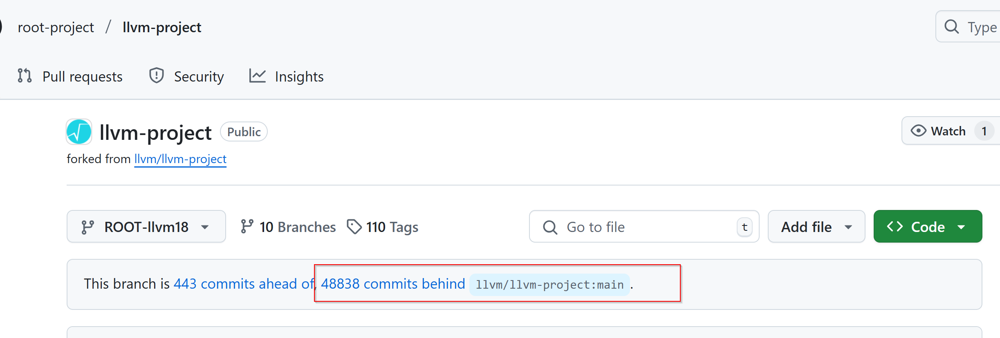

Seems that it's frutile to seek a C++ interpreter on Windows.

CERN's [root project][root] already created a [cling interperter][cling], but it doesn't provides a Windows version.
Also, it's using old LLVM libs.

see also [this blog post][blog-cling].

the newer one is [clang-repl], but it's still unstable...the build instructions is also frightening.

Well, clang-repl can be executed if you installed LLVM prebuilt exes. however, you will get weird errors due to CLANG not shipping Windows libs, and rather use Visual Studio's libs.

## Go?

Another project [GoNB][gonb] implemented support for Go kernel in jupyter, but it still doesn't support Windows...

[root]: https://root.cern.ch/
[gonb]: https://github.com/janpfeifer/gonb
[cling]: https://github.com/root-project/cling
[blog-cling]: http://root.cern/blog/cling-in-llvm/
[clang-repl]: https://github.com/compiler-research/xeus-clang-repl
