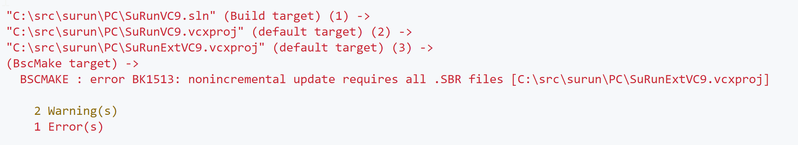

Currently, when building SuRun, I always get this error:

A quick search finds that it's [been deprecated since VS2008][1].

    BscMake is no longer used by the Visual Studio IDE. Since Visual Studio 2008, browse information is stored automatically in an .sdf file in the Solution folder.

But there are a bunch of them in the project files:

So I want to remove them programatically.

Python would be a good choice for reading and writing XML files. There are [many xml modules][xml] there. I need a library for both reading and writing, while preserving original formatting.

Well then, this concludes this TODO post.

[1]: https://learn.microsoft.com/en-us/visualstudio/msbuild/bscmake-task?view=vs-2022
[xml]: https://docs.python.org/3/library/xml.html
